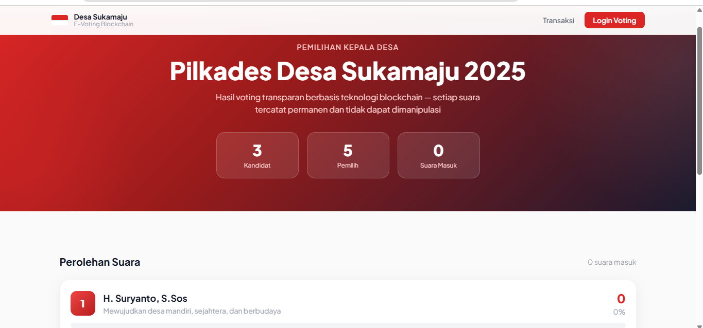
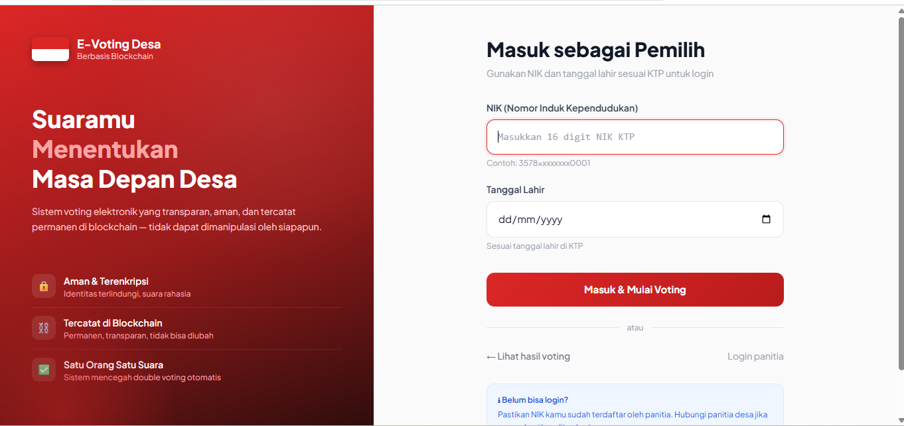
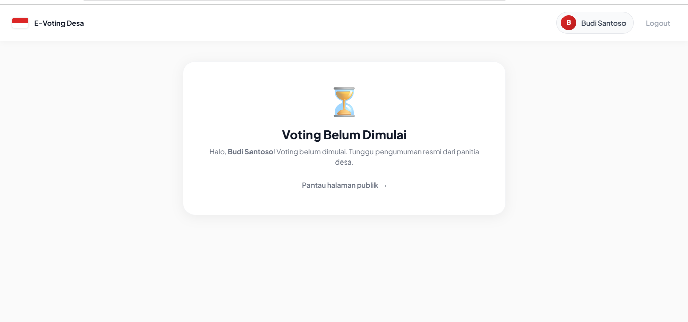
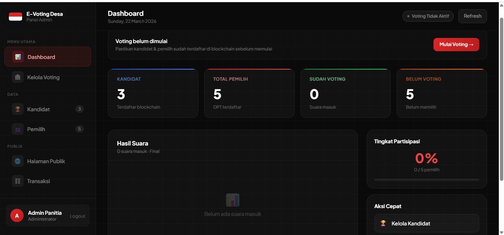
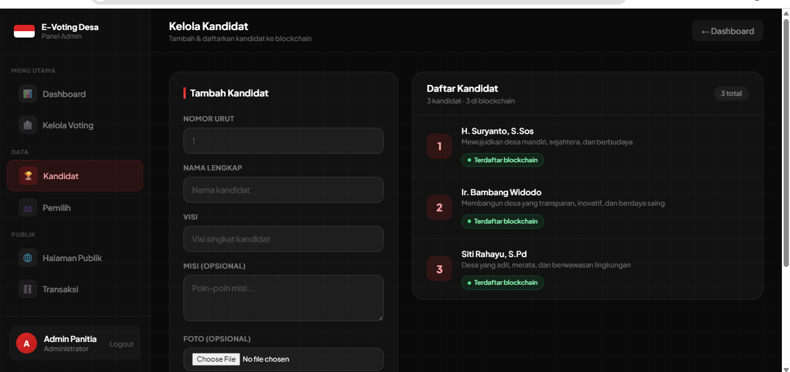
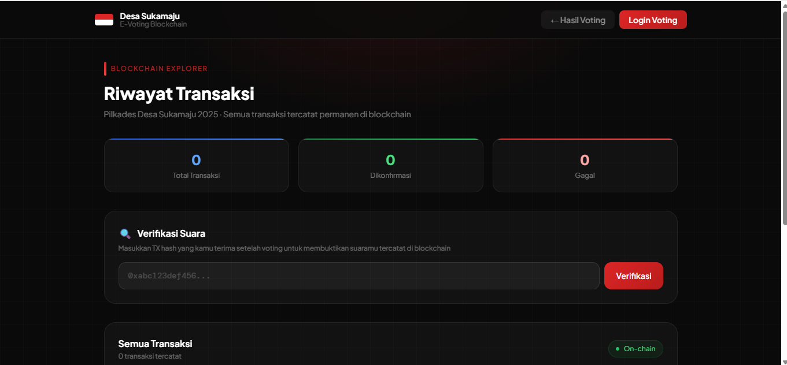

<div align="center">

# 🗳️ E-Voting Desa

### Sistem Pemilihan Kepala Desa Berbasis Blockchain

[](https://laravel.com)
[](https://soliditylang.org)
[](https://nodejs.org)
[](https://ethereum.org)
[](https://evoting-desa-ctl2.vercel.app)
[](LICENSE)

**Setiap suara tercatat permanen di blockchain — transparan, aman, dan tidak dapat dimanipulasi siapapun.**

[🌐 Live Demo](https://evoting-desa-ctl2.vercel.app) · [⛓️ Smart Contract](https://sepolia.etherscan.io/address/0x002B40a71EE2d8135a3e960D484DDf4C6dDD766e) · [📋 Laporan Bug](https://github.com/Fajarrosyidi24/evoting-desa/issues)

</div>

---

## 📸 Screenshot

| Halaman Publik | Login Warga | Halaman Voting |
|:-:|:-:|:-:|
|  |  |  |

| Dashboard Admin | Kelola Kandidat | Transaksi Blockchain |
|:-:|:-:|:-:|
|  |  |  |

---

## ✨ Fitur Utama

<table>
<tr>
<td width="50%">

**🔐 Untuk Warga**
- Login aman pakai NIK + tanggal lahir
- Tidak perlu MetaMask atau crypto wallet
- Suara tercatat permanen di blockchain
- Dapat TX hash sebagai bukti voting
- Verifikasi suara sendiri kapan saja

</td>
<td width="50%">

**⚙️ Untuk Admin / Panitia**
- Dashboard real-time dengan grafik
- Kelola kandidat & daftarkan ke blockchain
- Kelola DPT (Daftar Pemilih Tetap)
- Mulai & akhiri voting dengan durasi custom
- Export hasil & audit log transaksi

</td>
</tr>
<tr>
<td width="50%">

**🌐 Untuk Publik**
- Pantau hasil voting real-time
- Blockchain explorer — lihat semua transaksi
- Verifikasi suara via TX hash
- Auto refresh setiap 30 detik
- Tidak perlu login untuk melihat hasil

</td>
<td width="50%">

**⛓️ Keunggulan Blockchain**
- Data immutable — tidak bisa diubah
- Transparan — siapapun bisa audit
- Desentralisasi — tidak bergantung satu server
- Smart contract otomatis — tanpa perantara
- Deploy di Ethereum Sepolia Testnet

</td>
</tr>
</table>

---

## 🏗️ Arsitektur Sistem
```
┌─────────────────────────────────────────────────────────┐
│                      PENGGUNA                           │
│         Warga │ Admin/Panitia │ Publik/Auditor           │
└────────────────────────┬────────────────────────────────┘
                         │
                         ▼
┌─────────────────────────────────────────────────────────┐
│              FRONTEND (Blade + Tailwind CSS)             │
│    Halaman Publik │ Login │ Voting │ Dashboard Admin      │
└────────────────────────┬────────────────────────────────┘
                         │
                         ▼
┌─────────────────────────────────────────────────────────┐
│                BACKEND (Laravel 11)                      │
│   Auth │ BlockchainService │ API │ Controllers            │
└──────────────┬──────────────────────────┬───────────────┘
               │                          │
               ▼                          ▼
┌──────────────────────┐    ┌─────────────────────────────┐
│  DATABASE            │    │  SIGNER SERVICE (Node.js)    │
│  PostgreSQL          │    │  Express + ethers.js         │
│  (Supabase)          │    │  Sign & broadcast tx         │
└──────────────────────┘    └──────────────┬──────────────┘
                                           │
                                           ▼
                            ┌─────────────────────────────┐
                            │  BLOCKCHAIN                  │
                            │  Ethereum Sepolia Testnet    │
                            │  Smart Contract (Solidity)   │
                            └─────────────────────────────┘
```

---

## 🛠️ Tech Stack

| Layer | Teknologi | Versi |
|-------|-----------|-------|
| Smart Contract | Solidity + Hardhat | 0.8.19 |
| Blockchain Network | Ethereum Sepolia Testnet | — |
| Signer Service | Node.js + Express + ethers.js | v22 LTS |
| Backend | Laravel | 11 |
| Frontend | Blade + Tailwind CSS | 3 |
| Database | PostgreSQL (Supabase) | — |
| Hosting Laravel | Vercel | — |
| Hosting Signer | Vercel | — |

---

## 🚀 Demo Online

| Service | URL |
|---------|-----|
| 🌐 Website | [evoting-desa-ctl2.vercel.app](https://evoting-desa-ctl2.vercel.app) |
| 🔌 Signer API | [evoting-desa-three.vercel.app](https://evoting-desa-three.vercel.app) |
| ⛓️ Smart Contract | [Sepolia Etherscan](https://sepolia.etherscan.io/address/0x002B40a71EE2d8135a3e960D484DDf4C6dDD766e) |

### Akun Demo

| Role | Kredensial |
|------|-----------|
| 👨‍💼 Admin | Email: `admin@desa.id` · Password: `password123` |
| 🗳️ Warga | NIK: `3578012345678901` · Tgl Lahir: `1990-05-15` |

---

## ⚡ Cara Menjalankan Lokal

### Prasyarat
```bash
php --version    # >= 8.2
composer --version
node --version   # v22 LTS
npm --version
git --version
```

### Clone Repository
```bash
git clone https://github.com/Fajarrosyidi24/evoting-desa.git
cd evoting-desa
```

### Jalankan 4 Terminal Secara Bersamaan

**Terminal 1 — Hardhat Local Blockchain**
```bash
cd blockchain
npm install
npx hardhat node
```

**Terminal 2 — Deploy Smart Contract**
```bash
cd blockchain
cp .env.example .env
# Edit .env, isi ADMIN_PRIVATE_KEY dengan Account #0 dari Terminal 1

npx hardhat run scripts/deploy.js --network localhost
# Salin CONTRACT_ADDRESS dari output
```

**Terminal 3 — Node.js Signer Service**
```bash
cd evoting-signer
npm install
cp .env.example .env
# Edit .env dengan CONTRACT_ADDRESS dari Terminal 2

node index.js
# Test: curl http://localhost:3001/status -H "x-internal-secret: YOUR_SECRET"
```

**Terminal 4 — Laravel**
```bash
cd evoting-desa
composer install
cp .env.example .env
php artisan key:generate

# Edit .env sesuai konfigurasi lokal
touch database/database.sqlite
php artisan migrate
php artisan db:seed

php artisan serve
```

### Akses Aplikasi

| Halaman | URL |
|---------|-----|
| Hasil Voting Publik | http://localhost:8000 |
| Login Warga | http://localhost:8000/login |
| Login Admin | http://localhost:8000/admin/login |
| Riwayat Transaksi | http://localhost:8000/transaksi |

---

## 📁 Struktur Folder
```
evoting-desa/
│
├── 📂 evoting-desa/              # Laravel Backend & Frontend
│   ├── app/
│   │   ├── Http/Controllers/
│   │   │   ├── Admin/            # VotingController, KandidatController, PemilihController
│   │   │   ├── Auth/             # PemilihLoginController, AdminLoginController
│   │   │   ├── PublikController.php
│   │   │   └── VotingController.php
│   │   ├── Models/               # Pemilih, Kandidat, VotingLog, Setting
│   │   └── Services/
│   │       └── BlockchainService.php
│   ├── database/
│   │   └── seeders/DatabaseSeeder.php
│   ├── resources/views/          # Blade templates
│   │   ├── admin/                # Dashboard, kandidat, pemilih, voting
│   │   ├── auth/                 # Login admin & warga
│   │   ├── publik/               # Hasil & transaksi publik
│   │   └── voting/               # Halaman voting warga
│   └── vercel.json
│
├── 📂 evoting-signer/            # Node.js Blockchain Signer
│   ├── services/
│   │   └── blockchain.js         # ethers.js logic
│   ├── middleware/
│   │   └── auth.js               # Secret key validation
│   ├── index.js                  # Express server
│   └── vercel.json
│
└── 📂 blockchain/                # Smart Contract
    ├── contracts/
    │   └── Voting.sol            # Main smart contract
    ├── scripts/
    │   └── deploy.js             # Deploy script
    └── hardhat.config.js
```

---

## 🔄 Alur Sistem
```
1. Admin login → tambah kandidat → daftarkan ke blockchain
2. Admin tambah pemilih → daftarkan wallet ke smart contract
3. Admin mulai voting (set durasi dalam menit)
      ↓
4. Warga login dengan NIK + tanggal lahir
5. Warga pilih kandidat → konfirmasi di modal
6. Laravel kirim request ke Signer Service
7. Signer sign & broadcast transaksi ke blockchain
8. Smart contract catat suara secara permanen
9. Warga terima TX hash sebagai bukti
      ↓
10. Publik pantau hasil real-time di halaman publik
11. Admin akhiri voting → hasil final tampil
12. Siapapun verifikasi suara via TX hash
```

---

## 🔧 Perintah Berguna
```bash
# Reset total database + sync ulang ke blockchain
php artisan migrate:fresh --seed

# Sync ulang data ke blockchain (setelah Hardhat node restart)
php artisan blockchain:sync

# Generate APP_KEY baru
php artisan key:generate --show

# Clear semua cache
php artisan optimize:clear
```

---

## ⚠️ Catatan Penting

> **Hardhat local network reset setiap kali dimatikan.**
> Setelah Hardhat node di-restart, jalankan:
> ```bash
> npx hardhat run scripts/deploy.js --network localhost
> php artisan migrate:fresh --seed
> ```

> **Private key Hardhat bawaan bersifat publik.**
> Jangan gunakan untuk mainnet. Selalu generate wallet baru untuk production.

> **Vercel serverless limitation.**
> Session menggunakan cookie driver, queue menggunakan sync driver.

---

## 🤝 Kontribusi

Kontribusi sangat disambut! Silakan:

1. Fork repository ini
2. Buat branch baru: `git checkout -b feature/fitur-baru`
3. Commit perubahan: `git commit -m 'feat: tambah fitur baru'`
4. Push ke branch: `git push origin feature/fitur-baru`
5. Buat Pull Request

---

## 📄 Lisensi

Didistribusikan di bawah lisensi MIT. Lihat [LICENSE](LICENSE) untuk informasi lebih lanjut.

---

<div align="center">

Dibuat dengan ❤️ oleh [Fajar Rosyidi](https://github.com/Fajarrosyidi24)

⭐ **Kalau project ini bermanfaat, kasih star ya!** ⭐

</div>